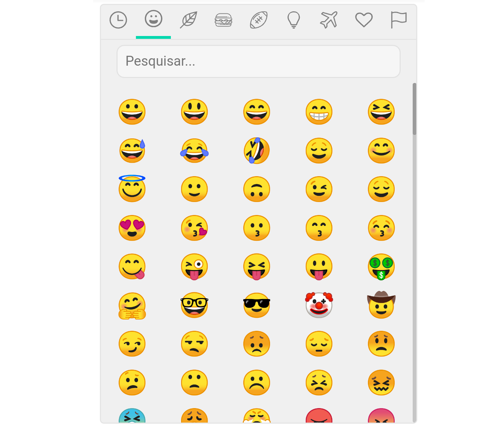

# V-Emoji-Picker
This simple package use Emojis Natives

[

](https://www.npmjs.com/package/v-emoji-picker)
[](https://vuejs.org/)



## Table of contents
- [Installation](#installation)
- [Usage](#usage)
- [Demo](#demo)

# Installation
```bash
yarn add v-emoji-picker
```
# Usage
```vue
<template>
  <div id="app">
    <VEmojiPicker :pack="pack" @select="selectEmoji" />
  </div>
</template>

<script>
import VEmojiPicker from 'v-emoji-picker';
import packData from 'v-emoji-picker/data/emojis.json';

export default {
  name: 'Demo',
  components: {
    VEmojiPicker
  },
  data: () => ({
    pack: packData
  }),
  methods: {
    selectEmoji(emoji) {
      console.log(emoji)
    }
  }
}
</script>

```

## Props
```js
{
  pack: { type: Array, required: true },
  labelSearch: { type: String, default: 'Pesquisar...' },
  showCategory: { type: Boolean, default: true },
  emojisByRow: { type: Number, default: 5 },
  showSearch: { type: Boolean, default: () => true }
}
```

## Events
```js
{
  select: 'Emit event on Selected Emoji',
  changeCategory: 'Emit event on Change Category'
}
```

# Estructure Emoji


# Demo
Click here to view in Browser:
[Vue Component | Emojis | Simples Example](https://codesandbox.io/s/0m9x7ooo8v)
